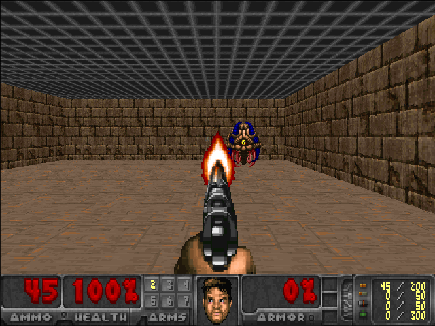
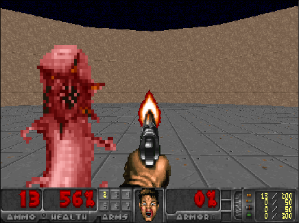
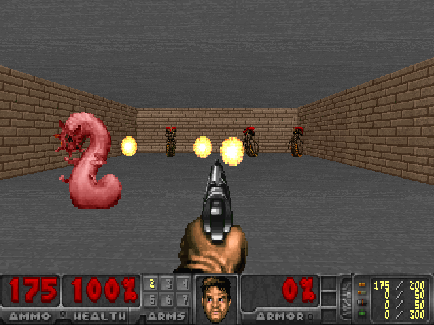

# Description

This is a gym-like wrapper over [VizDoom](http://vizdoom.cs.put.edu.pl) environment for deep reinforcement learning research. To install **vizdoom** python library, please follow the instructions from [VizDoom GitHub repository](https://github.com/mwydmuch/ViZDoom).

# Available scenarios

Here is the list of available scenarios (copied and adapted [from](https://github.com/mwydmuch/ViZDoom/blob/master/scenarios/README.md)):

| |  | 
|:---:|:---:|:---:|
|**Basic**|**Defend the center**|**Defend the line**|

## Basic

Map is a rectangle with gray walls, ceiling and floor. Player is spawned along the longer wall, in the center. A red, circular monster is spawned randomly somewhere along the opposite wall. Player can only go left/right and shoot. 1 hit is enough to kill the monster. Episode finishes when monster is killed or on timeout.

- **Actions:** move left, move right, shoot
- **Rewards:** +100 for killing the monster; -6 for missing; -1 otherwise
- **Episode termination:** monster is killed or after 300 time steps

## Defend the center

Map is a large circle. Player is spawned in the exact center. 5 melee-only, monsters are spawned along the wall. Monsters are 
killed after a single shot. After dying each monster is respawned after some time. Ammo is limited to 26 bullets. Episode ends when the player dies or on timeout.

- **Actions:** turn left, turn right, shoot
- **Rewards:** +1 for killing the monster; -0.1 for missing; -0.1 for losing health; -1 for death; 0 otherwise
- **Episode termination:** player is killed or after 2100 time steps

## Defend the line

Map is a rectangle. Player is spawned along the longer wall, in the center. 3 melee-only and 3 shooting monsters are spawned along the oposite wall. Monsters are killed after a single shot, at first. After dying each monster is respawned after some time and can endure more damage. Episode ends when the player dies or on timeout.

- **Actions:** move left, move right, turn left, turn right, shoot
- **Rewards:** +1 for killing the monster; -0.1 for missing; -0.1 for losing health; -1 for death; 0 otherwise
- **Episode termination:** player is killed or after 2100 time steps
